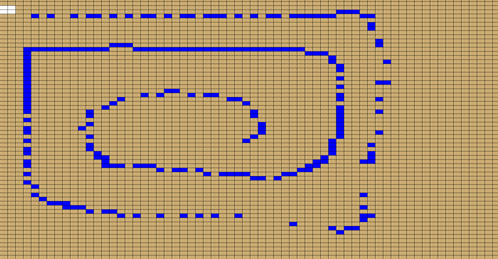
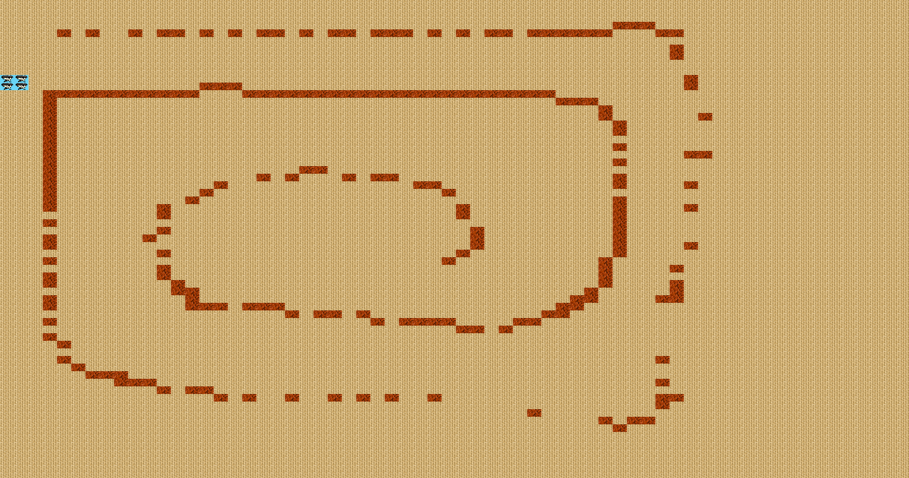
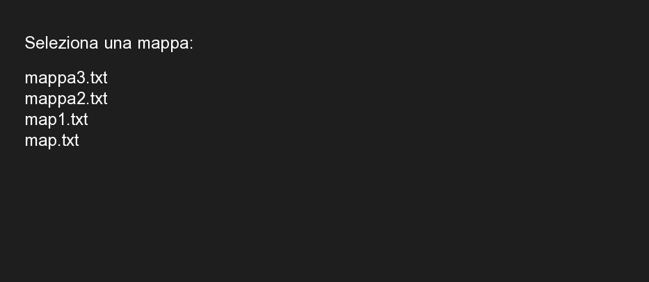
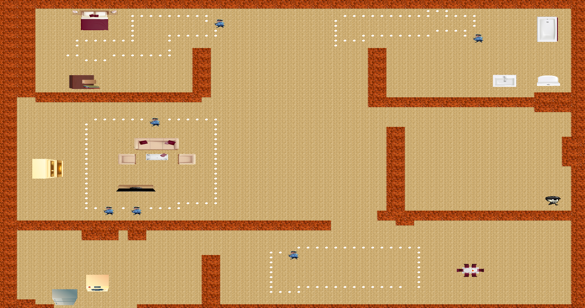
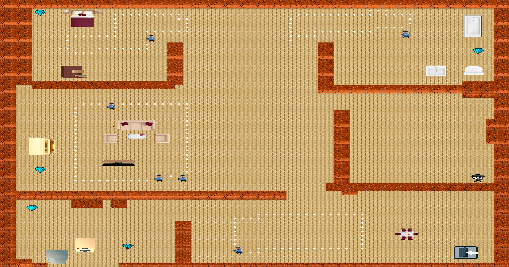
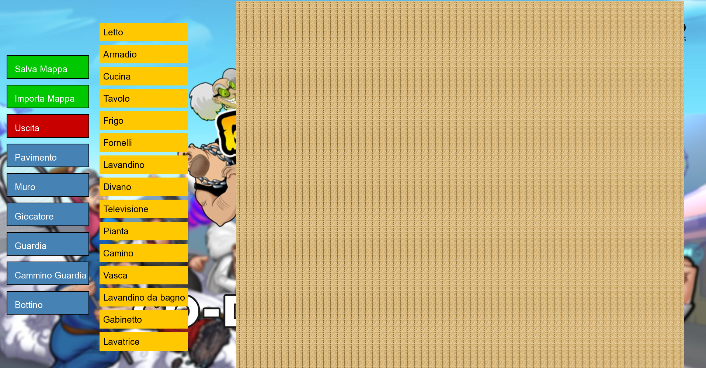

# Robbery-Rob-game

Robbery Rob è un videogioco 2D con visuale dall’alto, sviluppato in C++ utilizzando SFML. Il gioco è ispirato al gioco mobile _Robbery Bob_ e mette il giocatore nei panni di un ladro che deve infiltrarsi in edifici sorvegliati, rubare un oggetto e fuggire evitando le guardie.

Il gioco include:

- 2 modalità: gioca e disegna mappa
- Gestione di ciclo di gioco, salvataggio/caricamento mappe, interfaccia grafica
- Supporto a oggetti e texture di dimensioni variabili sulla griglia

<!--
## Step 1

**Generazione della griglia di gioco con settaggi standard**
Mi sono aiutato abbastanza con la documentazione di sfml-dev.org e ho compreso perchè avevo dei problemi con draw. All' inizio creavo la finestra con Window e non renderWindow e non usavo videomode
[Discussione su SFML Forum](https://en.sfml-dev.org/forums/index.php?topic=27467.0)

Ho inoltre crato anche un prepare.sh che mi permette di buildare e avviare il gioco in maniera più semplice

## Step 2
Inizio a pensare a quanto dovrebbe essere grande la matrice che compone la mappa per fare in modo che tutti gli oggetti di scena, il personaggio e le guardie siano proporzionate.
Per ora utilizzerò una **griglia 64 x 64** e il **player 2 x 2** sarà colorato di verde.

**Ho iniziato separando i file e dividendoli nelle cartelle:**
- Game gestisce il gioco
- matrix crea il campo di gioco
- Player crea il giocatore, lo disegna e contiene i listener di movimento

[Listener class reference](https://www.sfml-dev.org/documentation/2.6.1/classsf_1_1Listener.php)
[Simulating charachter move](https://en.sfml-dev.org/forums/index.php?topic=5378.0)
[Keyboard inputs SFML](https://stackoverflow.com/questions/45257041/taking-2-keyboard-inputs-with-sfml)

**Problemi:**

- **Ho notato qualche problema con la creazione di `CMakeLists.txt`** per l'aggiunta di tutte le directory, e in fase di compilazione volevo tenere solo `utils.hpp`, però ho dovuto creare anche `utils.cpp` e organizzare i file.

- **Ho dovuto ridimensionare la grandezza delle celle** in base alla grandezza della finestra / numero di celle, perché altrimenti uscivano dalla finestra visibile.

## Step 3

Durante questo step mi sono reso conto che il mio approccio non era seguibile e ho trasformato la matrice disegnata in una matrice di numeri creando i tipi che potrebbero servirmi in futuro:

```c
    TYPE_FLOOR = 0,
    TYPE_PLAYER = 1,
    TYPE_GUARD = 2,
    TYPE_FURNITURE = 3,
    TYPE_LOOT = 4,
    TYPE_VISUAL_GUARD = 5,
    TYPE_WALL = 6
  ```
Ho riorganizzato le classi tenendo solo un punto in cui la matrice viene disegnata e nella classe player la gestione della posizione di esso. Ho tolto anche tutte le costanti perchè le informazioni che contenevano me le calcolo dalla grandezza dello schermo del player e dalla matrice.

La matrice ora è più piccola di 64x64 ma solo per fare i test. Il prossimo passaggio sarà implementarla da un file.txt.

## Step 4

In questa fase ho riportato la griglia a 64x64 ma anche solo per fare i test sarebbe stato troppo difficile disegnare a mano le mappe. Così
ho creato una schermata iniziale con 2 bottoni:

**Gioca**  : carica una mappa già preimpostata e si può muovere il player.
**Disegna mappa** : viene mostrata una finestra in cui si possono osservare i bottoni del componenti dei principali elementi di gioco e se si clicca su uno di essi e poi si clicca su un punto della mappa noteremo che la cella cliccata si colorerà e l'oggetto selezionato è come se fosse stato posizionato in quel punto.

Alla fine delle modifiche cliccando su **salva** la mappa viene automoaticamente salvata.
In questo modo la creazione delle mappe sarà molto più veloce e c'è la possibilità che anche il player si crei delle mappe e con la possibilità in seguito di impostarne la difficoltà.

-->

## Step 1.0.0 – Migrazione a SFML 3 e Riorganizzazione del Progetto

Questa versione rappresenta il primo passo dopo la migrazione del progetto a **SFML 3**, mentre le versioni precedenti (non presenti) erano basate su **SFML 2.5**. Il gioco è già in uno stato abbastanza avanzato, poiché nei primi quattro step erano già state implementate diverse funzionalità fondamentali.

### Riorganizzazione del Progetto

In questo step è stata migliorata la struttura del progetto, seguendo un pattern più ordinato per l'organizzazione dei file. Le principali modifiche introdotte sono:

- Le immagini, le mappe e i file di risorse sono stati spostati nella cartella `resources/`.
- I file sorgente relativi alla Tappa 1 si trovano ora nella cartella `Tappa01/`.

Per supportare la migrazione da SFML 2.5 a 3.0, è stata seguita la documentazione ufficiale disponibile al seguente link:  
https://github.com/SFML/SFML/blob/master/migration.md

La migrazione non mi ha comportato particolari difficoltà, a parte la necessità di dichiarare esplicitamente tutti i componenti nei costruttori delle classi, cosa che nella versione precedente era gestita con maggiore flessibilità.

Questo step **non introduce nuove funzionalità**, ma ripropone il lavoro svolto nei precedenti step con SFML 2.5.
Di seguito una sintesi di quanto fatto in quei passaggi iniziali.

### Step Precedenti (con SFML 2.5)

1. **Inizio del progetto**  
   La finestra veniva inizialmente creata con `sf::Window`, senza l’utilizzo di `sf::RenderWindow` o `sf::VideoMode`. In seguito, questa scelta è stata corretta basandosi su una discussione nel forum SFML:  
   https://en.sfml-dev.org/forums/index.php?topic=27467.0
   Disegnavo solo la mappa di gioco senza avere una logica dietro

2. **Griglia e Giocatore**

   - È stata adottata una griglia di dimensioni 64x64.
   - Il giocatore ha dimensioni 2x2 ed è rappresentato con un colore verde.
   - Sono state introdotte le seguenti classi principali:
     - `Game`: gestisce il ciclo di gioco.
     - `Matrix`: gestisce la griglia di gioco.
     - `Player`: gestisce il disegno e il movimento del personaggio.  
       Riferimenti utili:
       - https://stackoverflow.com/questions/45257041/taking-2-keyboard-inputs-with-sfml
       - https://en.sfml-dev.org/forums/index.php?topic=5378.0

3. **Tipizzazione della Griglia**

   - È stato abbandonato il disegno diretto sulla griglia, passando a una rappresentazione numerica.
   - È stata introdotta una matrice di interi, ciascuno rappresentante un tipo di oggetto. I tipi definiti sono:

     ```c
     TYPE_FLOOR = 0,
     TYPE_PLAYER = 1,
     TYPE_GUARD = 2,
     TYPE_FURNITURE = 3,
     TYPE_LOOT = 4,
     TYPE_VISUAL_GUARD = 5,
     TYPE_WALL = 6
     ```

4. **Editor di Mappe**
   - Poiché disegnare mappe a mano era diventato poco pratico, è stata introdotta una schermata iniziale con due pulsanti:
     - **Gioca**: carica una mappa predefinita e consente il movimento del giocatore.
     - **Disegna mappa**: apre una modalità editor in cui si possono selezionare elementi (es. muri, oggetti, loot) da posizionare cliccando sulla mappa.

### Problemi Riscontrati

- **CMake e struttura dei file**  
  In fase di organizzazione dei file, è stato necessario creare anche `utils.cpp` oltre al già presente `utils.hpp`, per evitare errori di compilazione. È stato inoltre aggiornato il file `CMakeLists.txt` per includere correttamente tutte le directory.

- **Ridimensionamento delle celle**  
  È stato necessario calcolare dinamicamente la dimensione delle celle in base alla dimensione della finestra e alla quantità di celle, per evitare che alcune uscissero dal campo visivo.

## Step 02.0.0

In questo step ho:

- Aggiunto **Seleziona mappa** e **Salva mappa** tramite una finestra di dialogo, mi è stato utile il [forum SFML dialog](https://en.sfml-dev.org/forums/index.php?topic=29473.0)
  che mi ha portato a conoscienza della libreria [portable-file-dialogs](https://github.com/samhocevar/portable-file-dialogs)
- Corretto degli errori di movimento del player ( relativi a una confusione fra x e y)
- Aggiunto le texture del pavimento

Ora la schermata di gioco si presenta così:



## Step 3.0.0

In questo step ho aggiunto:

- **Le guardie** facendo una brutta versione dalla classe player. Fino ad ora ho solo sviluppato l' algoritmo che a inizio gioco visualizza tutte le guardie e crea ogni guardia inserendola in un vector apposta di Guardie.
- Le texture per i muri

Ho anche fixato:

- La visualizzazione della texture del player
- Un altro problema di segmentation faul perchè il player andava fuori dalla mappa

Problemi riscontrati:  
Ho avuto qualche problema solo nella creazione del vector di guardie perchè non ricordavo si potesse passare un solo parametro facendo il push_back di una class. Ho fixato subito leggendo questa discussione [Stack overflow push_back ](https://stackoverflow.com/questions/12083070/c-vectors-and-errors-no-instance-of-overloaded-function).

Ora quando si inizia una nuova partita si può osservare questa grafica:



## Step 4.0.0

In questo step ho innanzitutto cambiato metodo per la selezione e il salvataggio di una mappa creata.  
Prima mi appoggiavo a una libreria esterna che mi apriva un dialog dal quale potevo selezionare qualsiasi file dal computer. Ora invece stampo i nomi dei file .txt in questo modo:



Applico un background nero e, sopra di esso, i nomi dei file disponibili per la scelta. Inoltre, faccio scrivere manualmente il nome della mappa per il salvataggio.

Mi sto anche dedicando al refactoring, cercando di usare una sola funzione per disegnare la mappa, sia quando si gioca che quando si sta creando.  
Fatto questo, ho anche racchiuso in una funzione (messa nella classe `Matrix`) il posizionamento di un item scelto nella modalità "disegna mappa".

La funzione che ho creato e che reacchiude le 2 citate per disegnare la mappa è la seguente :

```cpp
void Matrix::draw(sf::RenderWindow &window, bool isGameMode)
{
    if (!isGameMode)
    {
        /* calcolo la posizione dela griglia:
            LARGHEZZA: da 1/3 sinistra a 10 px meno della fine dello schermo
            ALTEZZA: da 10 px sotto il limite a 10 px sopra il minimo
            */
        GRID_OFFSET_X = sf::VideoMode::getDesktopMode().size.x / 3;
        GRID_OFFSET_Y = 10;
        // calcolo il cell size
        cellWidth = (sf::VideoMode::getDesktopMode().size.x - GRID_OFFSET_X - 10) / GRID_SIZE;
        cellHeight = sf::VideoMode::getDesktopMode().size.y / rows;
    }
    else
    {
        GRID_OFFSET_X = 0;
        GRID_OFFSET_Y = 0;
        cellWidth = (sf::VideoMode::getDesktopMode().size.x) / GRID_SIZE;
        cellHeight = sf::VideoMode::getDesktopMode().size.y / rows;
    }

    for (int x = 0; x < cols; x++)
    {
        for (int y = 0; y < rows; y++)
        {
            sf::RectangleShape cell(sf::Vector2f(cellWidth, cellHeight));
            cell.setPosition({x * cellWidth + GRID_OFFSET_X,
                              y * cellHeight + GRID_OFFSET_Y});
            switch (map[x][y])
            {
            case TYPE_FLOOR:
                cell.setTexture(&floorTexture);
                break;
            case TYPE_PLAYER:
                cell.setTexture(&playerTexture);
                break;
            case TYPE_WALL:
                cell.setTexture(&wallTexture);
                break;
            }

            window.draw(cell);
        }
    }
}
```

## Step 5.0.0

In questo step ho iniziato creando due funzioni in `Guard`, simili a quelle presenti in `Player`.  
Una serve per gestire il movimento della guardia tramite la generazione di un numero random da 1 a 4,  
e l'altra mi permette di aggiornare la mappa.

Poi sono partito dall’idea di caricare anche le texture dell’arredamento e delle guardie,  
ma riflettendoci e cercando texture su internet mi sono reso conto che il mio approccio non è ottimale  
se voglio gestire molte texture.  
Così ho creato una `struct`:

```cpp
struct Texture {
    int type;
    std::string name;
    int width;
    int height;
    sf::Texture texture;
};
```

e una funzione che passati i parametri:

- `type`: ID corrispondente dell' enum
- `&name`: nome del file
- `w`: larghezza in celle
- `h`: altezza in celle

che carica automaticamente la texture.

A questo punto, ho anche aggiornato le funzioni che si occupano del posizionamento sulla mappa: non utilizzo più uno `switch`, visto che si presenterebbero più di 30 casi ma
avendo una `map` con `ID e Texture`. Vado direttamente a prendere la texture dalla mappa e la posiziono su n celle a seconda del valore di `width` e `height` dentro la struct texture

## Step 6.0.0

In questo step ho apportato diverse modifiche grafiche alla modalità `Disegna Mappa`.  
Ho caricato le texture degli arredamenti e implementato la gestione del loro posizionamento sulla mappa.  
Successivamente, ho ridimensionato tutte le texture e aggiornato il sistema di generazione della mappa.

Le mappe esistenti continuano a funzionare con le versioni precedenti alla 6, mentre le nuove mappe utilizzano il nuovo formato a partire dalla versione 6.

Infine, ho sistemato la gestione delle guardie, che ora vengono controllate tutte insieme in modo centralizzato.

## Step 7.0.0

In questo step mi sono concentrato nello sviluppo dell'algoritmo di movimento delle guardie.  
Ho fatto in modo che debbano raggiungere il percorso `TYPE_GUARD_ROUTE` più vicino e seguire quello.  
Se nel loro campo visivo (5×5 nella direzione in cui stanno andando) compare un player, iniziano a seguirlo  
calcolando la differenza tra la loro posizione e quella del player sugli assi x e y,  
in modo da decidere se muoversi in verticale o orizzontale.

Come negli step precedenti, ho inoltre corretto alcuni bug e fatto un leggero refactoring  
nella classe principale `Game` (modifiche semplici, come la rinomina di alcune variabili per rendere il codice più leggibile).

Ora la schermata di gioco si presenta così:



Inoltre ho capito come gestire la velocità delle guardie usando il delta time `dt`,  
seguendo alcuni suggerimenti trovati su [SFML Forum](https://en.sfml-dev.org/forums/index.php?topic=7636.0).

## Step 8.0.0

In questa versione ho fixato alcuni movimenti del player: prima veniva disegnato due volte, una volta mentre era fermo e un'altra mentre venivano letti i comandi di input.

Ho aggiunto anche la logica per il loot da prendere e per l'exit, che si attiva solo quando si prende tutto il loot.

Inoltre, ho inserito gli sprite per la schermata di **vittoria** (win) e di **game over**, che dovrebbero rimanere visibili per 5 secondi e poi riportare il giocatore alla schermata principale, ma questo non funziona ancora correttamente.

Avendo aggiunto nuovi elementi alla mappa, le mappe dello **step 6** funzionano ancora, ma **le versioni precedenti del gioco non sono compatibili con le mappe dello step 8** e non saranno in grado di leggerle correttamente.

La mappa di questo step si riconosce perché si chiama: `mapstep8.txt`

Il gioco ora si presenterà così:



## Step 9.0.0

In questa fase ho sistemato gli sprite di vittoria e game over, che prima non venivano mostrati correttamente alla fine del gioco. Ho anche corretto un bug che impediva di vincere in qualsiasi circostanza. Inoltre, ho aggiunto la possibilità di salvare i nomi delle mappe anche contenenti numeri, e ho implementato la possibilità di cancellare caratteri mentre si sta scrivendo il nome della mappa (funzionalità che fino ad ora non era presente).

## Step 10.0.0

In questo step ho riposizionato i bottoni di "Disegna mappa", assegnando loro dei colori più gradevoli e gestendo la loro creazione tramite una `struct` e un ciclo, per evitare di riscrivere le stesse dichiarazioni. Ora "Disegna mappa" si presenta così:



Inoltre, ho corretto due bug:

- uno riguardante l’aggiornamento dello score, che non si azzerava quando si cambiava mappa;
- un altro relativo al piazzamento degli oggetti, che prima potevano essere piazzati uno sopra l’altro.
